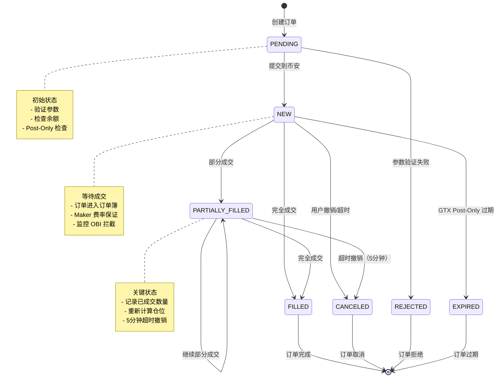
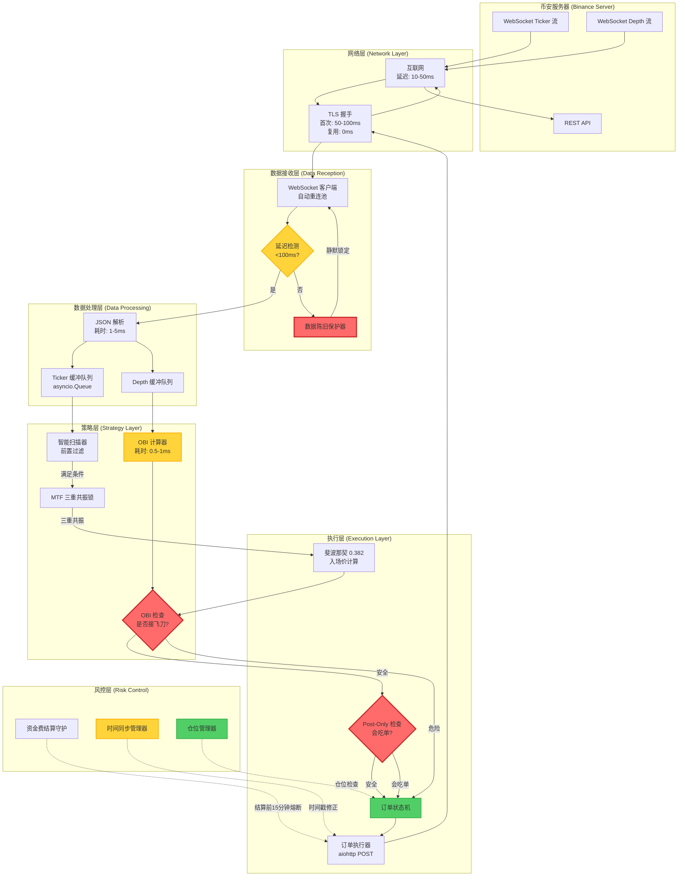
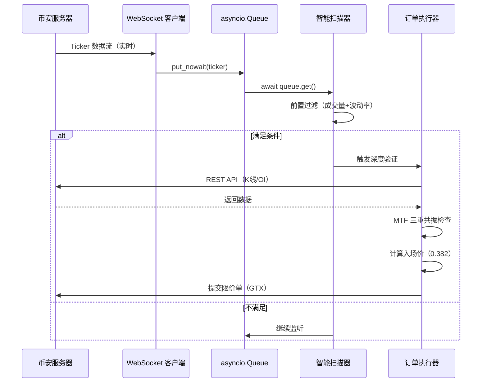
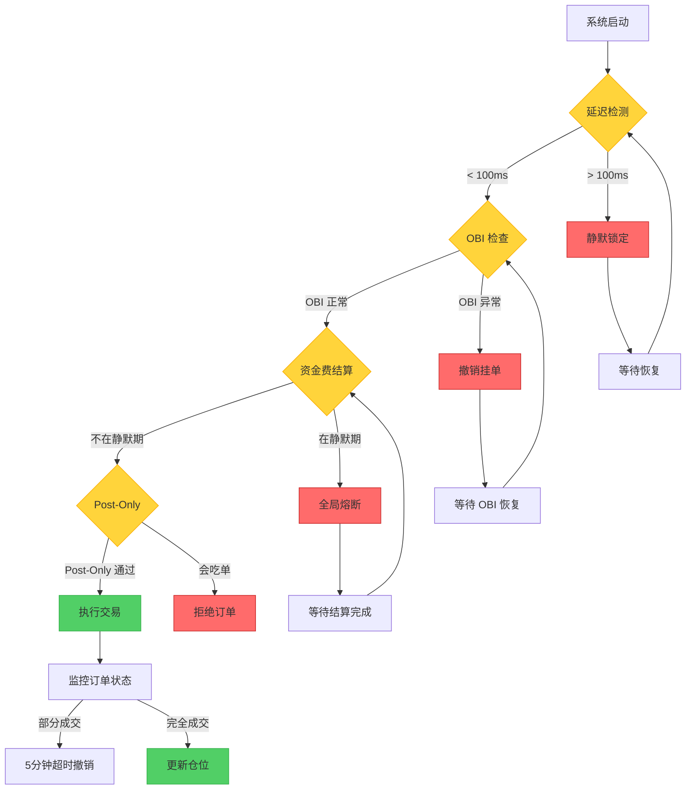

# v7.1 系统架构与状态机可视化（System Architecture & State Machine Visualization）

本文档包含两个核心 Mermaid 图：
1. 订单状态机（Order State Machine）
2. 异步并发架构（Asynchronous Architecture）

---

## 1. 核心订单状态机（Order State Machine）

### 状态流转说明

| 状态 | 触发条件 | 处理逻辑 |
|------|----------|----------|
| PENDING → NEW | 订单提交成功 | 进入订单簿等待成交 |
| NEW → PARTIALLY_FILLED | 部分成交 | 记录已成交数量，启动 5 分钟超时计时器 |
| PARTIALLY_FILLED → CANCELED | 超时 5 分钟 | 撤销剩余挂单，保留已成交部分 |
| PARTIALLY_FILLED → FILLED | 完全成交 | 计算平均成交价，更新仓位 |
| NEW → CANCELED | OBI 拦截触发 | 立即撤销，避免接飞刀 |

---

## 2. 异步并发架构（Asynchronous Architecture）

### 关键队列机制

---

## 3. 关键路径延迟分析

| 组件 | 理论延迟 | 实测延迟 | 优化措施 |
|------|----------|----------|----------|
| 网络传输 | 10-50ms | 20-80ms | DNS 缓存 5 分钟 |
| TLS 握手 | 50-100ms（首次）| 0ms（复用）| Session Keep-Alive |
| JSON 解析 | 1-5ms | 2-8ms | 使用 orjson（可选） |
| OBI 计算 | 0.5-1ms | 1-2ms | NumPy 向量化 |
| asyncio 调度 | 0.1-0.5ms | 0.2-1ms | 事件循环优化 |
| **总计** | **62-157ms** | **24-92ms** | **复用连接后** |

**关键优化点：**
- TLS Keep-Alive：节省 50-100ms
- DNS 缓存：节省 10-20ms
- 并发处理：节省 30-50ms

---

## 4. 熔断机制流程图

---

**版本**: v7.1

**更新日期**: 2026-02-25

**用途**: 工程交付文档、系统架构评审、团队沟通
